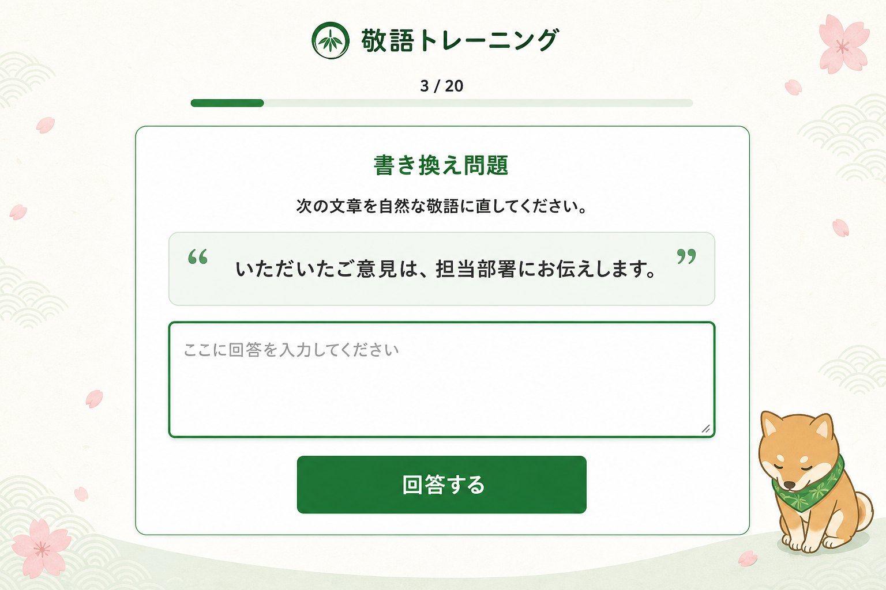
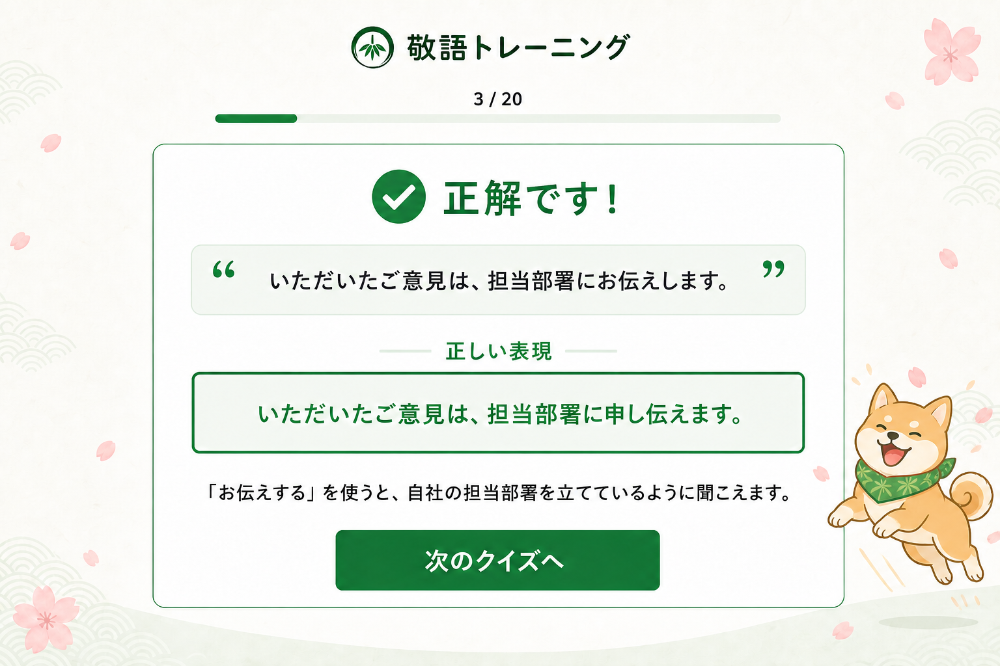
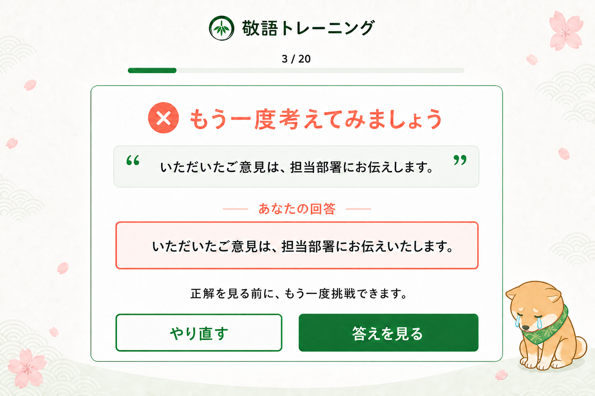
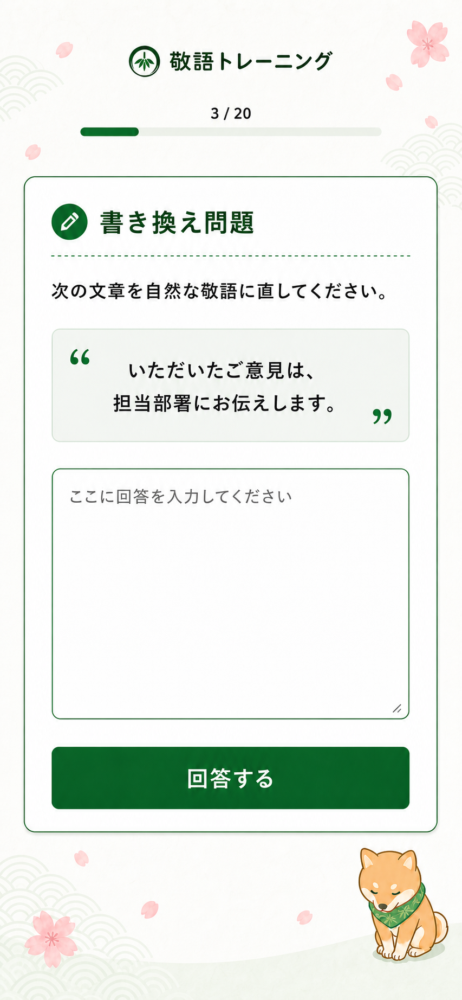

# デザインコンセプト

## ステータス

承認済みです。このデザインをアプリ実装時の基準とします。

## コンセプト

「やさしく学べる、和の敬語教室」をテーマにします。

問題文と回答操作を画面の中心に置き、若竹色と深い緑を基調にした、明るく親しみやすい学習画面です。日本らしさは、和紙のような背景、控えめな青海波、桜の花びら、竹のシンボルで表現します。おじぎする柴犬を小さなマスコットとして配置します。

装飾は画面の端に限定し、問題文、入力欄、選択肢、操作ボタンの読みやすさを優先します。

## 画面案

### 回答画面（デスクトップ）

### 正解画面（デスクトップ）

### 不正解画面（デスクトップ）

### 回答画面（スマートフォン）

## レイアウト

- 画面上部にブランド名と進行状況を表示します。
- 進行状況の下に細いプログレスバーを配置します。
- 問題、回答、結果は、一つの大きなメイン領域にまとめます。
- デスクトップでは中央に読みやすい幅で表示します。
- スマートフォンでは一列に並べ、ボタンを画面幅に近い大きさにします。
- サイドバー、ナビゲーション、統計情報などは置きません。

## カラー

実装時は、次の色を基準に画像と見比べながら調整します。

| 用途 | 基準色 |
| --- | --- |
| ブランドの濃い緑 | `#0B4F2A` |
| メインの緑 | `#087A32` |
| 薄い緑 | `#EAF4E9` |
| メイン背景 | `#FFFFFF` |
| 外側の背景 | `#FBFAF5` |
| 本文 | `#202320` |
| 補助文字 | `#717771` |
| 不正解のコーラル | `#F06450` |
| 桜のピンク | `#F3B6BE` |

## タイポグラフィ

- 見出し：丸みのある日本語ゴシック体
- 本文：読みやすい日本語ゴシック体
- 実装候補：`Zen Maru Gothic`、`Noto Sans JP`、システムの日本語サンセリフ
- 問題文と回答文は、本文より大きく、十分な行間を取ります。
- ボタンの文字は太くし、ブラウザの初期設定には依存しません。

## コンポーネント

- ブランドヘッダー
- プログレス表示
- 問題タイプ表示
- 問題文の引用領域
- Yes / No選択肢
- マルチプルチョイス選択肢
- 書き換え用テキストエリア
- メインボタン
- 枠線付きサブボタン
- 正解結果
- 不正解結果
- 解説領域

## 状態ごとの表現

### 未回答

- 入力欄または選択肢を最も目立たせます。
- 「回答する」を緑のメインボタンとして表示します。

### 正解

- 緑のチェックアイコンと「正解です！」を表示します。
- 正しい表現を薄い緑の領域で強調します。
- 「次のクイズへ」をメインボタンとして表示します。
- 柴犬のマスコットは、笑顔で楽しくジャンプする姿にします。

### 不正解

- 強すぎないコーラル色で「もう一度考えてみましょう」と表示します。
- ユーザーの回答を薄いコーラル色の領域に表示します。
- 「やり直す」は枠線付き、「答えを見る」は緑のメインボタンにします。
- 柴犬のマスコットは、耳を下げて涙を流す悲しそうな姿にします。

## アイコンとイラスト

- ブランドマーク：円の中に竹の葉
- 正解：白いチェックを含む緑の円
- 不正解：白いバツを含むコーラル色の円
- 問題形式：必要な場合のみ、同じ太さのシンプルな線または塗りアイコンを使用
- マスコット：緑の和柄スカーフを着けた柴犬。通常時はおじぎ、正解時はジャンプ、不正解時は涙を流す姿
- 背景装飾：桜、青海波、薄い和紙の質感

## 動き

- 問題が切り替わるときは、短いフェードとわずかな上方向の移動を使用します。
- 正解・不正解は、アイコンと見出しを穏やかに表示します。
- `prefers-reduced-motion`が指定されている場合は、動きを停止します。

## 実装上の制約

- 文字、ボタン、入力欄、プログレスバーは画像にせず、HTMLとCSSで実装します。
- 柴犬、桜、青海波などの装飾は、操作や読み上げを妨げないようにします。
- 色だけに頼らず、正解・不正解を文字とアイコンでも伝えます。
- 実装後は、デスクトップとスマートフォンの画面をこのコンセプト画像と比較します。

## ImageGenプロンプトセットの要点

組み込みのImageGenを使用し、次の4種類を同一のデザインシステムで生成しました。

1. デスクトップの書き換え問題回答画面
2. デスクトップの正解結果画面
3. デスクトップの不正解結果画面
4. スマートフォンの書き換え問題回答画面

各プロンプトには、表示する日本語をそのまま指定し、緑基調、白いメイン領域、和紙、青海波、桜、竹のブランドマーク、おじぎする柴犬、コードで実装可能な構造、余計なナビゲーションや統計を追加しないことを指定しました。
